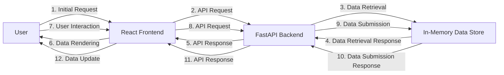

# Executive Summary
The ram-weather-optimizer-tool is a FastAPI and React application designed to optimize Windows 11's built-in Weather app RAM usage. This tool provides a user-friendly interface to monitor and manage the Weather app's memory consumption, ensuring a seamless user experience.

# Architecture Overview
The ram-weather-optimizer-tool consists of two primary components: the FastAPI backend and the React frontend. The FastAPI backend handles API requests, manages the in-memory data store, and provides endpoints for data submission and retrieval. The React frontend is a single-page application that interacts with the FastAPI backend, displaying real-time data and providing a user interface for data submission.

## End-to-End System Architecture Flow Diagram

## API Contracts
The FastAPI backend provides the following API endpoints:

* `POST /submit`: Submits user data to the in-memory data store.
* `GET /retrieve`: Retrieves data from the in-memory data store.
* `POST /reset`: Resets the in-memory data store.

## Frontend Component Architecture
The React frontend consists of the following components:

* `App`: The main application component.
* `Dashboard`: Displays real-time data and provides a user interface for data submission.
* `Form`: Handles user input and submits data to the FastAPI backend.
* `Table`: Displays retrieved data.

## Automated Testing Setup
The application uses Pytest for automated testing. The test suite includes tests for API endpoints, data submission, and data retrieval.

## Step-by-Step Local Running Instructions
1. Install backend packages: `pip install -r requirements.txt`
2. Start the backend: `uvicorn backend.app:app --reload --port 8000`
3. Setup and start the frontend: `cd frontend && npm install && npm run dev`
4. Access the application: `http://localhost:5173`

## CORS Configuration
The FastAPI backend is configured to allow CORS requests from the React frontend. This enables local communication between the two components.

## In-Memory Data Store
The application uses a global Python list to store data in-memory. This data store is reset when the `POST /reset` endpoint is called.

## Security Considerations
The application does not include authentication or authorization mechanisms. This is intended for local development and testing purposes only. In a production environment, proper security measures should be implemented.