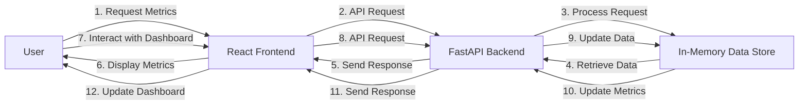

# Executive Summary
The ram-weather-optimizer-tool is a comprehensive solution designed to optimize Windows 11's built-in Weather app RAM usage. This tool utilizes a FastAPI backend and a React frontend to provide real-time metrics and interactive dashboards. The primary goal of this project is to reduce the RAM waste caused by the Weather app, which can exceed 1 GB.

# Architecture Overview
The ram-weather-optimizer-tool consists of two primary components: the FastAPI backend and the React frontend. The backend is responsible for handling API requests, processing data, and storing it in an in-memory data store. The frontend is a React application that interacts with the backend API to display real-time metrics and provide interactive dashboards.

## End-to-End System Architecture Flow Diagram

## API Contracts
The FastAPI backend provides the following API endpoints:

* `GET /metrics`: Retrieves real-time metrics from the in-memory data store.
* `POST /submit`: Submits new data to the in-memory data store.
* `POST /reset`: Resets the in-memory data store.

## Frontend Component Architecture
The React frontend consists of the following components:

* `App`: The main application component that renders the dashboard.
* `Metrics`: A component that displays real-time metrics.
* `Dashboard`: A component that provides interactive dashboards.
* `Form`: A component that allows users to submit new data.

## Automated Testing Setup
The project uses Pytest for automated testing. The test suite includes tests for the FastAPI backend API endpoints and the React frontend components.

## Step-by-Step Local Running Instructions
To run the project locally, follow these steps:

1. Install the backend packages: `pip install -r requirements.txt`
2. Start the backend: `uvicorn backend.app:app --reload --port 8000`
3. Install the frontend packages: `cd frontend && npm install`
4. Start the frontend: `npm run dev`
5. Open a web browser and navigate to `http://localhost:5173` to access the React frontend.

Note: CORS is enabled in the FastAPI backend to allow local communication between the frontend and backend. This allows the frontend to make API requests to the backend without being blocked by same-origin policy restrictions.