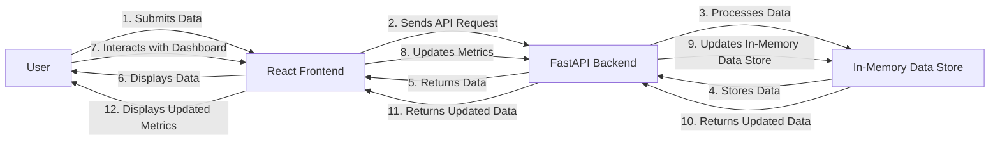

# Executive Summary
The ram-weather-optimizer-tool is a comprehensive solution designed to optimize the Windows 11 Weather app's RAM usage. This tool utilizes a FastAPI backend and a React frontend, leveraging the power of Tailwind CSS for styling. The primary goal of this project is to provide a user-friendly interface for monitoring and optimizing the Weather app's memory consumption.

# Architecture Overview
The ram-weather-optimizer-tool consists of two primary components: the FastAPI backend and the React frontend. The backend is responsible for handling API requests, processing data, and storing it in an in-memory data store. The frontend, built with React and Tailwind CSS, provides a sleek and modern interface for users to interact with the tool.

## Backend Architecture
The FastAPI backend is designed to handle the following endpoints:
- `POST /data`: Submit data to the in-memory data store.
- `GET /data`: Retrieve data from the in-memory data store.
- `POST /reset`: Reset the in-memory data store.

## Frontend Architecture
The React frontend is composed of several components, including:
- A dashboard for displaying real-time system logs and metrics.
- A form for submitting data to the backend.
- A visualizer for displaying custom metrics.

## End-to-End Flow Diagram

# API Contracts
The FastAPI backend exposes the following API endpoints:
- `POST /data`: Expects a JSON payload with the following structure: `{"key": "string", "value": "string"}`.
- `GET /data`: Returns a JSON response with the following structure: `{"data": [{"key": "string", "value": "string"}]}`.
- `POST /reset`: Expects no payload and returns a JSON response with the following structure: `{"message": "Data store reset successfully"}`.

# Frontend Component Architecture
The React frontend is composed of the following components:
- `App.js`: The main application component.
- `Dashboard.js`: The dashboard component for displaying real-time system logs and metrics.
- `Form.js`: The form component for submitting data to the backend.
- `Visualizer.js`: The visualizer component for displaying custom metrics.

# Automated Testing Setup
The project utilizes Pytest for automated testing. The test suite includes tests for the following scenarios:
- Successful API calls.
- Validation errors.
- In-memory state modifications.

# Step-by-Step Local Running Instructions
To run the project locally, follow these steps:
1. Install the backend packages: `pip install -r requirements.txt`
2. Start the backend: `uvicorn backend.app:app --reload --port 8000`
3. Setup and start the frontend: `cd frontend && npm install && npm run dev`
4. Open a web browser and navigate to `http://localhost:5173` to access the React frontend.

Note: CORS is enabled on the FastAPI backend to allow local communication between the frontend and backend. This allows the frontend to make requests to the backend without being blocked by the browser's same-origin policy.