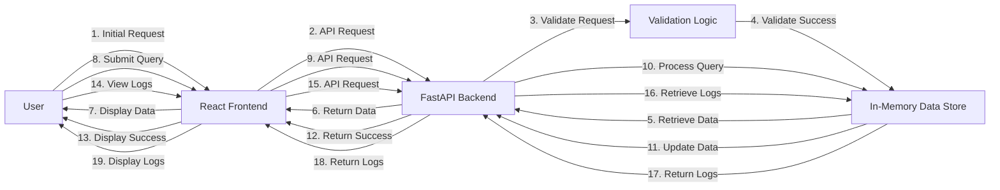

# Executive Summary
The ram-weather-optimizer-tool is a FastAPI and React application designed to optimize Windows 11's built-in Weather app RAM usage. This tool provides a user-friendly interface to monitor and manage the Weather app's memory consumption, ensuring a seamless user experience.

# Architecture Overview
The ram-weather-optimizer-tool consists of two primary components: the FastAPI backend and the React frontend. The FastAPI backend handles API requests, manages the in-memory data store, and provides endpoints for data submission and retrieval. The React frontend provides a user-friendly interface to interact with the backend, displaying real-time data and allowing users to submit queries and view results.

## End-to-End System Architecture Flow Diagram


# API Contracts
The FastAPI backend provides the following API endpoints:

* `POST /submit`: Submits a query to the in-memory data store.
* `GET /data`: Retrieves data from the in-memory data store.
* `POST /reset`: Resets the in-memory data store.
* `GET /logs`: Retrieves system logs from the in-memory data store.

## API Request/Response Formats
All API requests and responses are in JSON format.

### Submit Query Request
```json
{
    "query": "string"
}
```

### Submit Query Response
```json
{
    "success": true
}
```

### Retrieve Data Request
```json
{
    "key": "string"
}
```

### Retrieve Data Response
```json
{
    "value": "string"
}
```

### Reset Request
```json
{
    "confirm": true
}
```

### Reset Response
```json
{
    "success": true
}
```

### Retrieve Logs Request
```json
{
    "limit": 10
}
```

### Retrieve Logs Response
```json
{
    "logs": [
        {
            "timestamp": "string",
            "message": "string"
        }
    ]
}
```

# Frontend Component Architecture
The React frontend consists of the following components:

* `App`: The main application component.
* `Dashboard`: Displays real-time data and allows users to submit queries.
* `Logs`: Displays system logs.
* `SubmitQuery`: Handles query submission.
* `RetrieveData`: Handles data retrieval.

# Automated Testing Setup
The application uses Pytest for automated testing. The test suite includes tests for API endpoints, validation logic, and in-memory data store interactions.

# Step-by-Step Local Running Instructions
1. Install backend packages: `pip install -r requirements.txt`
2. Start the backend: `uvicorn backend.app:app --reload --port 8000`
3. Setup and start the frontend: `cd frontend && npm install && npm run dev`
4. Access the application: `http://localhost:5173`

Note: CORS allows local communication between the React frontend and the FastAPI backend. The FastAPI backend is configured to allow requests from the React dev server (`http://localhost:5173`).