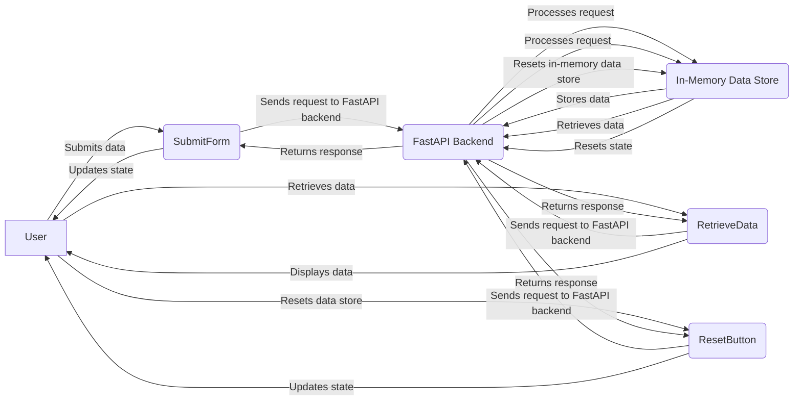

# Executive Summary
The ram-weather-optimizer-tool is a FastAPI and React application designed to optimize Windows 11's built-in Weather app RAM usage. This tool provides a user-friendly interface for users to interact with the Weather app and optimize its RAM usage.

# Architecture Overview
The application consists of two main components: the FastAPI backend and the React frontend. The FastAPI backend handles API requests and interacts with the in-memory data store, while the React frontend provides a user-friendly interface for users to interact with the application.

## FastAPI Backend
The FastAPI backend is responsible for handling API requests and interacting with the in-memory data store. It provides endpoints for users to submit data, retrieve data, and reset the in-memory data store.

### API Endpoints
The following API endpoints are available:

* `POST /submit`: Submits data to the in-memory data store.
* `GET /retrieve`: Retrieves data from the in-memory data store.
* `POST /reset`: Resets the in-memory data store.

### In-Memory Data Store
The in-memory data store is a global Python list that stores data submitted by users. The data store is reset when the `POST /reset` endpoint is called.

## React Frontend
The React frontend provides a user-friendly interface for users to interact with the application. It uses the FastAPI backend API endpoints to submit and retrieve data.

### Components
The React frontend consists of the following components:

* `App`: The main application component.
* `SubmitForm`: A form component that allows users to submit data.
* `RetrieveData`: A component that displays retrieved data.
* `ResetButton`: A button component that resets the in-memory data store.

### State Management
The React frontend uses the `useState` hook to manage state. The state is updated when the user submits data or retrieves data.

## End-to-End Flow Diagram

# API Contracts
The following API contracts are available:

* `POST /submit`: Expects a JSON payload with the following structure: `{"key": "value"}`.
* `GET /retrieve`: Returns a JSON response with the following structure: `{"key": "value"}`.
* `POST /reset`: Expects no payload.

# Frontend Component Architecture
The React frontend consists of the following components:

* `App`: The main application component.
* `SubmitForm`: A form component that allows users to submit data.
* `RetrieveData`: A component that displays retrieved data.
* `ResetButton`: A button component that resets the in-memory data store.

# Automated Testing Setup
The application uses Pytest for automated testing. The tests are located in the `backend/test_app.py` file.

# Step-by-Step Local Running Instructions
To run the application locally, follow these steps:

1. Install the required packages: `pip install -r requirements.txt`
2. Start the FastAPI backend: `uvicorn backend.app:app --reload --port 8000`
3. Install the required frontend packages: `cd frontend && npm install`
4. Start the React frontend: `cd frontend && npm run dev`
5. Open a web browser and navigate to `http://localhost:5173` to access the application.

Note: Make sure to allow CORS requests in the FastAPI backend to enable communication between the React frontend and the FastAPI backend.