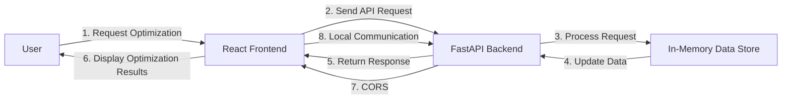

# Executive Summary
The ram-weather-optimizer-tool is a comprehensive solution designed to optimize the Windows 11 Weather app's RAM usage. This tool features real-time metrics and interactive dashboards, providing users with a seamless experience. The project utilizes a FastAPI backend, a React frontend, and Tailwind CSS for styling.

## Architecture Overview
The architecture of the ram-weather-optimizer-tool consists of the following components:
- **Frontend**: Built using React, Vite, and Tailwind CSS, the frontend provides an interactive interface for users to view real-time metrics and optimize the Weather app's RAM usage.
- **Backend**: Developed using FastAPI, the backend handles API requests, processes data, and updates the in-memory data store.
- **In-Memory Data Store**: A global Python list/dictionary variable stores data in-memory, allowing for efficient data retrieval and updates.

## End-to-End System Architecture Flow Diagram

## API Contracts
The FastAPI backend provides the following API endpoints:
- **POST /reset**: Resets the in-memory data store.
- **POST /optimize**: Optimizes the Weather app's RAM usage.
- **GET /metrics**: Retrieves real-time metrics.

## Frontend Component Architecture
The React frontend consists of the following components:
- **App**: The main application component.
- **Dashboard**: Displays real-time metrics and optimization results.
- **Optimizer**: Handles optimization requests and updates the in-memory data store.

## Automated Testing Setup
The project uses pytest for automated testing. The test suite includes:
- **Test Client**: Tests API endpoints using the FastAPI TestClient.
- **Fixtures**: Ensures clean state and test isolation using pytest fixtures.

## Step-by-Step Local Running Instructions
1. Install backend packages: `pip install -r requirements.txt`
2. Start the backend: `uvicorn backend.app:app --reload --port 8000`
3. Setup and start the frontend: `cd frontend && npm install && npm run dev`
4. Access the application: `http://localhost:5173`

## CORS and Local Communication
CORS (Cross-Origin Resource Sharing) allows the React frontend to communicate with the FastAPI backend, enabling local development and testing. The FastAPI backend is configured to allow requests from the React dev server (`http://localhost:5173`).