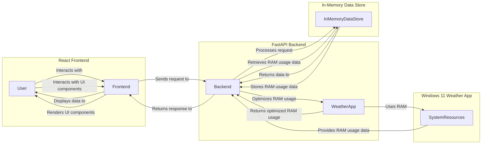

# ram-weather-optimizer-tool
Optimize Windows 11 Weather app RAM usage with this tool

## Executive Overview
The ram-weather-optimizer-tool is designed to help users optimize the RAM usage of the built-in Weather app in Windows 11. The tool consists of a FastAPI backend and a React frontend, allowing users to monitor and control the Weather app's RAM usage.

## Feature Breakdown
* Monitor Weather app RAM usage in real-time
* Receive alerts when RAM usage exceeds a certain threshold
* Optimize Weather app RAM usage with a single click
* View detailed statistics on Weather app RAM usage

## API Contract Summary
The FastAPI backend provides the following API endpoints:
* `GET /ram-usage`: Returns the current RAM usage of the Weather app
* `POST /optimize`: Optimizes the Weather app's RAM usage
* `GET /stats`: Returns detailed statistics on Weather app RAM usage
* `POST /reset`: Resets the in-memory data store

## End-to-End System Architecture Flow Diagram

## Running the Application
### Backend
1. Install required packages: `pip install -r requirements.txt`
2. Start the backend: `uvicorn backend.app:app --reload --port 8000`

### Frontend
1. Change into the frontend directory: `cd frontend`
2. Install required packages: `npm install`
3. Start the frontend: `npm run dev`

### CORS
The FastAPI backend is configured to allow CORS requests from the React frontend, allowing local communication between the two applications.

## Badges

